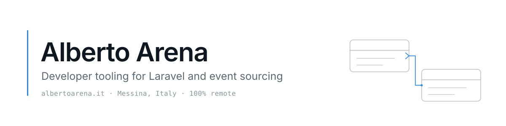

<picture>
  <source media="(prefers-color-scheme: dark)" srcset="./assets/banner-dark.svg">
  
</picture>

Senior software engineer. I build and maintain developer tooling for Laravel and event
sourcing, and I write about Laravel, developer tools, and AI-assisted coding with Claude Code.

### 📬 Newsletter

Subscribe and get my free Spatie Event Sourcing cheat sheet (printable PDF), plus practical notes on Laravel and AI-assisted development, roughly once a month. No spam.

**[Get the cheat sheet →](https://albertoarena.it/subscribe/?utm_source=github&utm_medium=profile&utm_campaign=newsletter&utm_content=albertoarena)**

## Currently

- Shipping [**Truss**](https://github.com/albertoarena/laravel-truss), a live ER diagram of your Laravel schema. Structure only, never data, so it is safe in production. The latest release adds `truss:doctor`, a schema health check that can fail your CI build. [Docs](https://trussphp.com)
- Bringing Spatie event sourcing into Filament v4 with [**filament-event-sourcing**](https://github.com/albertoarena/filament-event-sourcing).
- Working out how far a Claude Code skill can replace a code generator, in [**claude-laravel-event-sourcing**](https://github.com/albertoarena/claude-laravel-event-sourcing).
- Available for freelance and consulting work. [Here is what that looks like](https://albertoarena.it/pages/consulting/).

## What I maintain

**Laravel**

- [laravel-truss](https://github.com/albertoarena/laravel-truss) reads your schema and draws it as a scrollable, zoomable ER diagram.
- [codemetry-laravel](https://github.com/albertoarena/codemetry-laravel) brings git-powered code quality metrics to a Laravel app.

**Event sourcing**

- [laravel-event-sourcing-generator](https://github.com/albertoarena/laravel-event-sourcing-generator) scaffolds a whole Spatie domain from one Artisan command.
- [filament-event-sourcing](https://github.com/albertoarena/filament-event-sourcing) writes through aggregates, browses stored events, and replays projectors from a Filament panel.

**Claude Code**

- [claude-laravel-event-sourcing](https://github.com/albertoarena/claude-laravel-event-sourcing) designs and generates event-sourced domain code for you.
- [claude-code-laravel-starter](https://github.com/albertoarena/claude-code-laravel-starter) is a lean docs skeleton for Laravel. CLAUDE.md is RAM, docs/ is disk.

Smaller tools

- [envaudit](https://github.com/albertoarena/envaudit) validates `.env` files in a pipeline. Zero dependencies.
- [laravel-netsons-deploy](https://github.com/albertoarena/laravel-netsons-deploy) deploys a Laravel app to Netsons shared hosting from a GitHub Action.
- [github-traffic-badge](https://github.com/albertoarena/github-traffic-badge) turns repository traffic into a badge.

## Latest posts

<!-- BLOG-POST-LIST:START -->
- Aug 5, 2026 · [I built a Laravel event-sourcing generator, then the AI version](https://albertoarena.it/posts/generator-vs-ai-skill/)
- Aug 3, 2026 · [I gave my schema viewer your app's colours](https://albertoarena.it/posts/gave-my-schema-viewer-your-app-colours/)
- Aug 1, 2026 · [We Became Editors-in-Chief, and Nobody Trained Us](https://albertoarena.it/posts/we-became-editors-in-chief/)
- Jul 31, 2026 · [The schema doctor is in](https://albertoarena.it/posts/the-schema-doctor-is-in/)
- Jul 27, 2026 · [CLAUDE.md Is RAM, Skills Are Not Disk: The Four-Tier Memory Model for Claude Code](https://albertoarena.it/posts/claude-md-skills-are-not-disk/)<!-- BLOG-POST-LIST:END -->

[Read all posts on my blog](https://albertoarena.it) · [RSS](https://albertoarena.it/rss.xml)

---

[albertoarena.it](https://albertoarena.it) · [@alberto_arena](https://x.com/alberto_arena) · [LinkedIn](https://www.linkedin.com/in/alberto-arena-ba44a624/)
